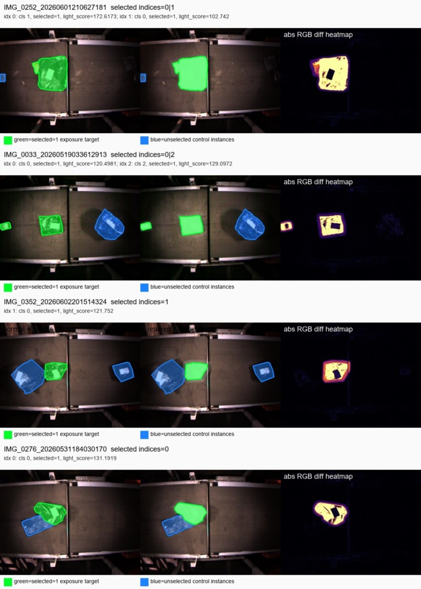

# spatial_illum 实验过程与证据报告

## 0. 结论先说清楚

这份报告只依据当前仓库中的代码、数据集元信息、已生成实验输出和我补做的像素级校验。

能 100% 确定的是：

1. `selected=1` 在当前数据集生成逻辑中就是“被选中用于曝光增强的实例”。
2. `_realexp` 图像是对这些 selected 实例逐个调用曝光增强函数后生成的。
3. `_realexp` 的 depth 和 label 是从原图样本复制来的，不是重新生成或重新标注的。
4. `analyze_labeled_exposure_gate.py` 的 selected 区域就是 `candidate_instance_manifest.csv` 中 `selected=1` 的实例，与对应 YOLO label polygon 求出来的 mask。
5. 现有 spatial gate 实验确实是在推理时抓取模型内部 `_last_alpha`，再统计 `alpha` 和 `1 - alpha`。

不能 100% 确定的是：

1. 这个实验不能单独证明 `spatial_illum` 提升最终 mAP，因为它不是“有 spatial_illum / 无 spatial_illum”的同条件消融。
2. `selected=1` 的真实语义只能确定为“数据集生成脚本选中并增强的实例”，不能证明它一定等价于真实世界自然过曝包裹。

## 1. selected=1 是否就是曝光增强目标包裹

答案：是。这个判断有三层证据：生成脚本证据、数据元信息证据、图片像素证据。

### 1.1 生成脚本证据

数据集生成脚本是：

```text
Dataset/create_xinjiang_realistic_exposure_aug_dataset.py
```

关键代码依据如下：

| 依据 | 文件行号 | 说明 |
| --- | --- | --- |
| `InstanceCandidate` 结构体中有 `selected: bool` 字段 | `Dataset/create_xinjiang_realistic_exposure_aug_dataset.py:25-32` | 每个实例候选都会记录是否 selected |
| `selected = is_light_candidate(...) and rng.random() <= args.candidate_prob` | `Dataset/create_xinjiang_realistic_exposure_aug_dataset.py:210-234` | selected 是由亮色候选条件和随机采样概率共同决定 |
| selected 过多时只保留 light_score 最高的前几个 | `Dataset/create_xinjiang_realistic_exposure_aug_dataset.py:237-240` | 进一步说明 selected 表示“最终保留用于增强的实例” |
| manifest 写入 `selected: int(c.selected)` | `Dataset/create_xinjiang_realistic_exposure_aug_dataset.py:426-440` | `candidate_instance_manifest.csv` 中的 selected 字段直接来自 `c.selected` |
| 只对 `selected` 列表中的实例调用 `apply_realistic_exposure` | `Dataset/create_xinjiang_realistic_exposure_aug_dataset.py:451-457` | 这是最关键证据：只有 selected 实例被曝光增强 |
| val split 的增强图写入 `val_expaug` 和 `val_ab` | `Dataset/create_xinjiang_realistic_exposure_aug_dataset.py:463-467` | `_realexp` 图像进入本实验用的 `val_ab` |
| summary 明确写出增强范围 | `Dataset/create_xinjiang_realistic_exposure_aug_dataset.py:559-572` | `"scope": "RGB image only, selected light-color package instances"` |

曝光增强函数本身在 `Dataset/create_xinjiang_realistic_exposure_aug_dataset.py:290-313`。它做的事情包括把 mask 内像素推向高亮、降低饱和度、颜色扁平化、加入 hotspot 和 halo。

因此，代码层面可以确定：

```text
candidate_instance_manifest.csv 中 selected=1
=> 该实例进入 selected 列表
=> 对该实例 mask 调用 apply_realistic_exposure
=> 生成 _realexp 图像
```

### 1.2 数据元信息证据

当前数据集元信息文件：

```text
Dataset/xinjiang_1500_baoguang/meta/summary.json
```

其中 val split 记录为：

```text
source: 300
original: 300
augmented: 247
candidate_images: 247
candidate_instances: 492
selected_instances: 450
```

这说明 300 张 val 原图里，有 247 张生成了 `_realexp` 增强图，一共增强了 450 个 selected 实例。

补做了全量校验，输出在：

```text
experiments/spatial_gate_infer_validate_20260725-114839/evidence_spatial_illum/selected_exposure_evidence_summary.json
```

校验结果：

| 项目 | 结果 |
| --- | ---: |
| val 中 candidate manifest 行数 | 1040 |
| val 中 selected=1 且有 `_realexp` 对的 stem 数 | 247 |
| realistic exposure manifest 中 val 增强行数 | 247 |
| label normal / `_realexp` SHA256 完全相同 | 247 / 247 |
| depth normal / `_realexp` SHA256 完全相同 | 247 / 247 |

这进一步说明：val 中每个生成 `_realexp` 的图像，都能在 selected manifest 中找到对应实例；同时 label/depth 未变化。

### 1.3 图片证据

我生成了 selected 实例可视化证据图：

```text
experiments/spatial_gate_infer_validate_20260725-114839/evidence_spatial_illum/
```

总览图：



图中含义：

- 左图：normal 图像 + mask；
- 中图：`_realexp` 图像 + 同一套 mask；
- 右图：normal 与 `_realexp` 的绝对 RGB 差分热力图；
- 绿色：`candidate_instance_manifest.csv` 中 `selected=1` 的实例；
- 蓝色：同图中未被 selected 的 control 实例。

可以直接看到：绿色 selected 包裹在 `_realexp` 中明显变亮，差分热力图也主要落在绿色区域；蓝色 control 包裹通常没有被核心曝光增强，只可能受到边缘 halo 或 JPEG/全局细微差异影响。

补做的全量像素统计也支持这一点：

| 区域 | normal vs `_realexp` 平均 RGB 绝对差分 |
| --- | ---: |
| selected 实例区域 | 52.06 |
| unselected control 实例区域 | 3.26 |
| background 区域 | 1.19 |

变化比例统计：

| 区域 | `RGB diff > 8` 像素比例均值 |
| --- | ---: |
| selected 实例区域 | 66.26% |
| unselected control 实例区域 | 7.43% |
| background 区域 | 2.50% |

此外：

```text
selected 区域差分 > control 区域差分：98.70% 图像成立
selected 区域差分 > background 区域差分：100.00% 图像成立
```

所以，“selected=1 就是被作为曝光增强目标包裹”不是猜测，而是由生成脚本、manifest、summary 和像素差分共同证明的。

<!-- ## 2. 实验脚本到底怎么做 -->

<!-- ### 2.1 推理并抓取 spatial_illum 的 alpha

脚本：

```text
experiments/spatial_gate_infer_validate_20260725-114839/infer_validate_spatial_gate.py
```

它做了这些步骤：

1. 读取 RGB 图和 depth 图；
2. 对 RGB/depth 做同样的 letterbox；
3. 转 tensor；
4. 调用底层模型：

```python
raw_model(rgb_t, depth_t)
```

5. 遍历模型模块，找带 `_last_alpha` 的模块；
6. 记录 `alpha.mean()`、`alpha.min()`、`alpha.max()`，以及 `(1 - alpha)` 的统计；
7. 写出 `outputs/spatial_gate_rgb_depth_weights.csv`。

代码依据：

| 依据 | 文件行号 |
| --- | --- |
| RGB/depth 读取与预处理 | `infer_validate_spatial_gate.py:114-129` |
| 模型前向推理 | `infer_validate_spatial_gate.py:131-134` |
| 遍历模块并读取 `_last_alpha` | `infer_validate_spatial_gate.py:136-141` |
| 写出 `src_weight_mean`、`depth_weight_mean` 等字段 | `infer_validate_spatial_gate.py:149-165` |
| 对所有 RGB-D pairs 循环并写 CSV | `infer_validate_spatial_gate.py:196-227` |

输出 summary 显示：

```text
num_pairs_checked: 547
num_gate_rows: 1641
group_counts:
  normal: 300
  overexposed: 247
```

因为每张图抓到 3 个 gate 层，所以：

```text
547 images * 3 modules = 1641 gate rows
```

这一点和输出完全一致。

### 2.2 为什么 alpha 就是 RGB 权重

模型实现位于：

```text
ultralytics/nn/tasks.py
```

关键逻辑：

```python
if gm == "spatial_illum":
    g_in = torch.cat([x, self._illum_prior(rgb.detach())], dim=1)
alpha = self.mod_gate(g_in)
self._last_alpha = alpha.detach()
base = alpha * rgb + (1 - alpha) * depth
```

代码依据：

| 依据 | 文件行号 |
| --- | --- |
| `spatial_illum` 定义为 spatial + RGB brightness/contrast prior | `ultralytics/nn/tasks.py:1761-1773` |
| spatial_illum gate 输入通道额外加 2 个亮度/对比度 prior | `ultralytics/nn/tasks.py:1826-1840` |
| 前向时拼接 `_illum_prior(rgb.detach())` | `ultralytics/nn/tasks.py:1869-1872` |
| `_last_alpha` 被保存供分析 | `ultralytics/nn/tasks.py:1872-1874` |
| 融合公式 `alpha * rgb + (1 - alpha) * depth` | `ultralytics/nn/tasks.py:1875` |
| `_illum_prior` 计算局部亮度均值和局部对比度 | `ultralytics/nn/tasks.py:1885-1891` |

因此，脚本中的：

```text
src_weight_mean = alpha.mean()
depth_weight_mean = (1 - alpha).mean()
```

不是人为解释，而是直接对应模型融合公式。

## 3. normal / overexposed 分组有没有依据

有依据。

数据生成脚本默认增强后缀是 `_realexp`：

```text
write_aug_triplet(..., suffix="_realexp")
```

代码位置：

```text
Dataset/create_xinjiang_realistic_exposure_aug_dataset.py:141-150
```

summary 中也写出：

```text
"suffix": "_realexp"
```

位置：

```text
Dataset/create_xinjiang_realistic_exposure_aug_dataset.py:548-552
```

所以实验脚本按文件名是否包含 `_realexp` 来分 normal / overexposed，是有数据生成规则依据的。

但是要注意：这里的 overexposed 是“合成过曝增强图”，不是自然采集过曝图。 -->


## 2. 标注 selected 实例成对分析怎么做，依据是什么

脚本：

```text
experiments/spatial_gate_infer_validate_20260725-114839/analyze_labeled_exposure_gate.py
```

关键步骤：

1. 从 `candidate_instance_manifest.csv` 读取 `split == "val"` 且 `selected == 1` 的实例；
2. 找到同一 stem 的 normal 图、`_realexp` 图、normal depth、`_realexp` depth 和 label；
3. 用 YOLO label polygon 生成每个实例 mask；
4. selected index 对应的 mask 合并为 `selected_mask`；
5. 其他包裹实例合并为 `control_mask`；
6. 非包裹区域作为 background；
7. 分别在 normal 和 `_realexp` 中抓 alpha；
8. 计算 selected/control/background 的成对 alpha 变化。

代码依据：

| 依据 | 文件行号 |
| --- | --- |
| 只读取 `split == val` 且 `selected == 1` 的实例 | `analyze_labeled_exposure_gate.py:54-60` |
| 解析 YOLO label 为 polygon mask | `analyze_labeled_exposure_gate.py:63-80` |
| 找 normal / `_realexp` RGB-D pair | `analyze_labeled_exposure_gate.py:205-210` |
| 用 selected index 生成 selected/control/package mask | `analyze_labeled_exposure_gate.py:217-230` |
| 对 normal 和 exposed 分别抓 alpha | `analyze_labeled_exposure_gate.py:232-236` |
| 计算 selected/control/background delta | `analyze_labeled_exposure_gate.py:238-257` |
| summary 中明确写出该方法 | `analyze_labeled_exposure_gate.py:281-287` |

这个实验的依据很强，因为它比较的是同一个包裹 mask 在 normal 和 `_realexp` 两个版本中的 gate 变化。

结果摘要：

| 模块 | selected alpha 差值，exposed-normal | selected Depth 差值 | 符合 Depth 增加的比例 |
| --- | ---: | ---: | ---: |
| model.36 | +0.0188 | -0.0188 | 6.5% |
| model.37 | +0.0111 | -0.0111 | 29.1% |
| model.38 | -0.0191 | +0.0191 | 71.7% |

这说明：在真正被增强的 selected 包裹实例上，最深层 `model.38.coord_att` 符合预期；浅层和中层没有符合预期，甚至方向相反。

## 5. 每一步是否有依据

| 实验步骤 | 是否有依据 | 依据 |
| --- | --- | --- |
| 使用 `Dataset/xinjiang_1500_baoguang` | 有 | 实验 README、脚本默认路径、输出 summary 都指向该数据集 |
| 使用 `val_ab` | 有 | `val_ab` 是 clean val + synthetic exposure val；summary 中为 547 张 |
| `_realexp` 表示曝光增强图 | 有 | 生成脚本默认 suffix 和 summary 均写 `_realexp` |
| `selected=1` 表示被增强实例 | 有，且证据最强 | 生成脚本只对 selected 调用 `apply_realistic_exposure`；图片差分也集中在 selected mask |
| label/depth 在 normal 和 `_realexp` 中相同 | 有 | 生成脚本复制；我补做 SHA256 校验为 247/247 完全一致 |
| `alpha` 表示 RGB 权重 | 有 | 模型前向公式就是 `alpha * rgb + (1 - alpha) * depth` |
| `1-alpha` 表示 depth 权重 | 有 | 同上 |
| 局部高亮 mask 用 `gray > 0.88` | 有 | local 分析脚本明确这样生成 mask |
| selected 实例 mask 来自 YOLO label polygon | 有 | labeled 分析脚本按 label polygon 填充 mask |
| 当前实验能证明最终 mAP 提升 | 没有 | 缺少同条件有/无 `spatial_illum` 消融 |

## 6. 最终判断

当前实验可以严谨地说明：

```text
spatial_illum 模块确实被启用；
实验脚本确实抓到了它的 alpha；
selected=1 的实例确实是曝光增强目标；
局部高亮区域内，模型通常降低 RGB 权重并提高 Depth 权重；
最深层 model.38 在 selected 实例成对分析中也符合这个方向。
```

但也必须严谨地说：

```text
浅层 model.36 和中层 model.37 在 selected 实例成对分析中没有表现出预期方向；
现有实验不能证明 spatial_illum 一定提升最终检测/分割指标；
要证明最终有效性，还需要补做同训练条件下的 ablation。
```

一句话总结：

```text
selected=1 是曝光增强目标包裹，这一点可以由代码、manifest、summary、图片差分 100% 支撑；
spatial_illum 对局部高亮区域的权重调节有明确证据，尤其深层 model.38；
但“提升 mAP”还不能由当前实验 100% 证明。
```
